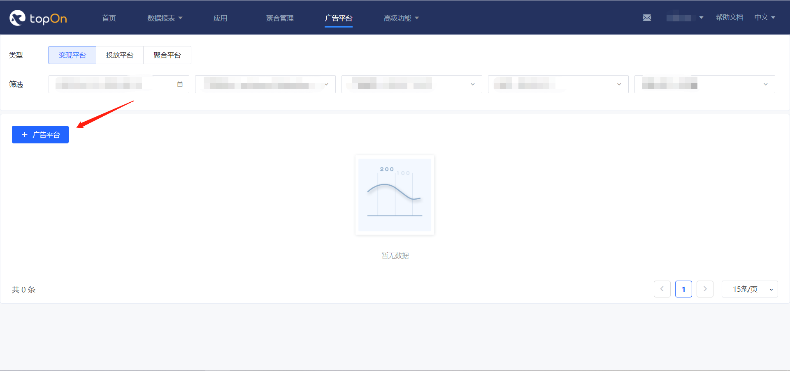
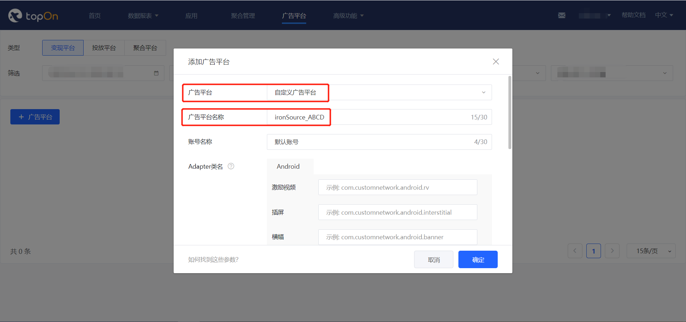
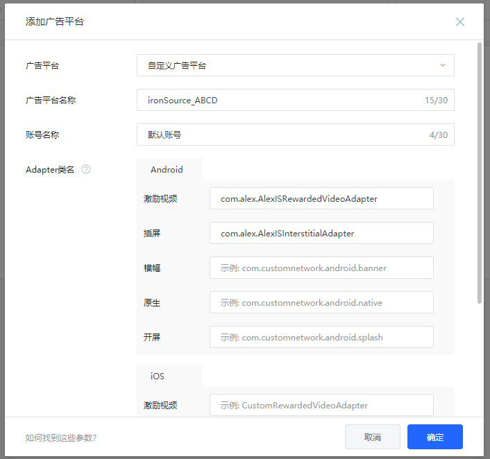
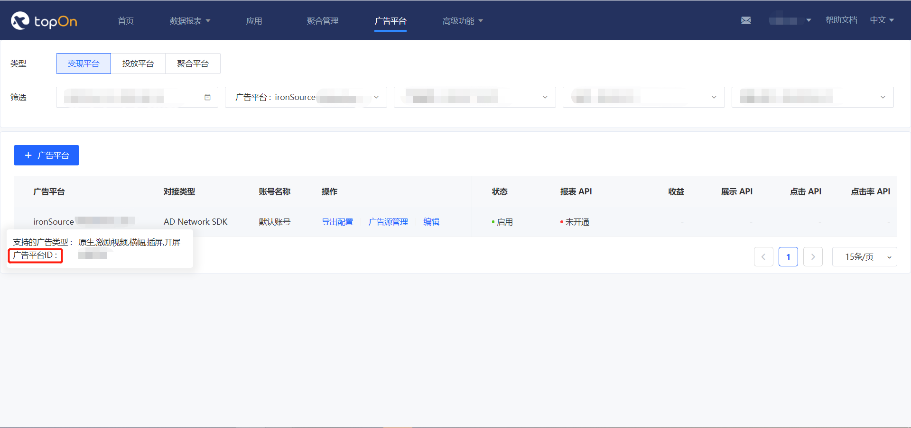
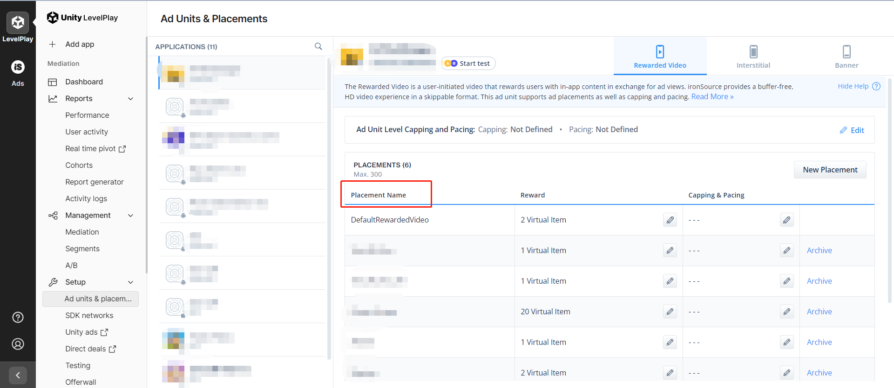
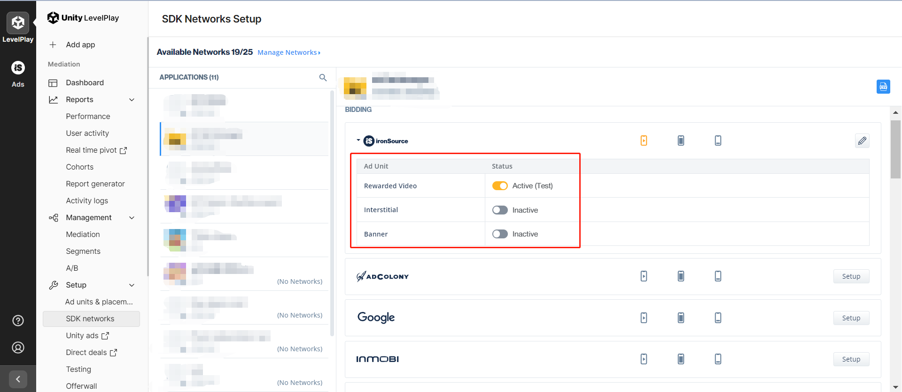
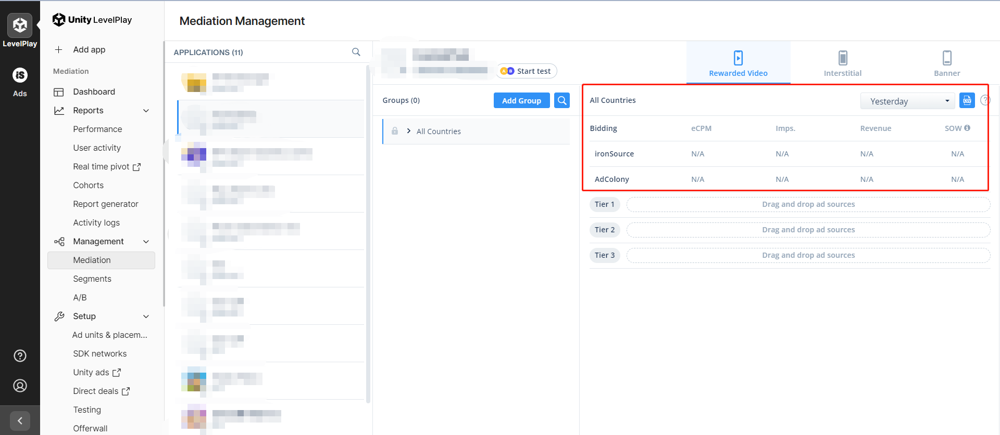
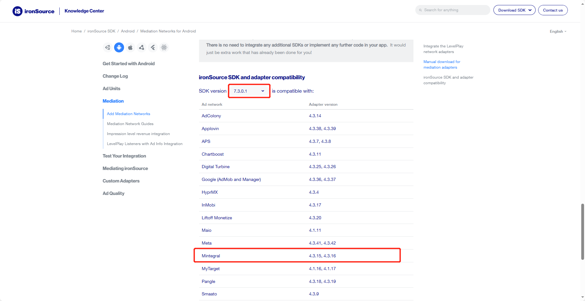

# 集成

Tip: If necessary, please refer to [the English documentation](https://github.com/Alex-only/AlexIronSourceDemo_Android/blob/main/README_EN.md)

## 一. 接入TopOn SDK

请参考[TopOn SDK集成文档](https://docs.toponad.com/#/zh-cn/android/android_doc/android_sdk_config_access)接入TopOn SDK，建议接入**TopOn v6.2.30及以上版本**


## 二. 引入Alex Adapter

1、在build.gradle中添加以下代码，引入平台SDK（以下为ironSource v7.3.0.1的引入代码）

```java
repositories {
    maven {
        //IronSource
        url "https://android-sdk.is.com/"
    }
}

dependencies {
    implementation 'androidx.appcompat:appcompat:1.2.0'
    implementation 'com.google.android.gms:play-services-ads-identifier:18.0.1'
    
    //Add IronSource Mediation SDK dependency.
    implementation 'com.ironsource.sdk:mediationsdk:7.3.0.1'
}
```

2、以下方式任选其一即可：

（1）**aar**：将alex_adapter_ironsource.aar放到项目module的libs文件夹下（如果没有libs文件夹，则需要创建），然后在build.gradle中进行引入

```java
dependencies {
    implementation fileTree(dir: 'libs', include: ['*.jar','*.aar'])
}
```

（2）**源码**：

*将AlexLib目录下的代码复制拷贝到项目module下的src/main/java中，可根据需要修改各个Adapter的包名或者类名。

*在项目的proguard-rules.pro中添加以下混淆规则（如果有修改类名，keep的类名需改为修改后的类名）

```java
-keep class com.alex.** { *;}
-keepclassmembers public class com.alex.** {
   public *;
}
```

3、Adapter中使用的Key说明如下：

```
"sdk_key": 广告平台的SDK Key
"plid": 广告平台的Placement Name
```

后台添加广告源时的JSON配置示例如下：（xxx需要替换为ironSource实际的SDK key以及广告位ID）

```
{
    "sdk_key":"xxx",
    "plid":"xxx"
}
```


### 三. 后台配置

1、按照SDK对接文档接入同时，需要在后台添加自定义广告平台



2、选择【自定义广告平台】，填写广告平台名称、账号名称，按照SDK的对接文档填写Adapter

*广告平台名称需要写上ironSource，便于区分广告平台，建议名称格式：ironSource_XXXXX



**注意**：如果是使用aar方式或者直接使用源码方式（没有修改类名），请配置以下类名。如果修改了类名，请配置修改后的类名

```
激励视频：com.alex.AlexISRewardedVideoAdapter
插屏：com.alex.AlexISInterstitialAdapter
```



3、记录广告平台ID



4、广告平台添加完成后，再添加广告源（添加广告源时按照对应样式配置即可）

5、可编辑广告平台设置，选择是否开通报表api并拉取数据

6、ironSource后台的操作可以参考下面流程

创建Placement



开启应用的ironSource bidding



配置瀑布流




### 四. ironSource接入其他广告平台

如果不需要通过ironSource接入其他广告平台，可跳过此部分内容。以接入Mintegral为例：

1、先到 [TopOn后台](https://docs.toponad.com/#/zh-cn/android/download/package)，查看接入的TopOn版本兼容的Mintegral版本是多少？（TopOn v6.2.30版本兼容的Mintegral版本为v16.4.31）

2、然后到 [ironSource后台](https://developers.is.com/ironsource-mobile/android/mediation-networks-android/#step-2)，根据接入的ironSource SDK版本（v7.3.0.1）和Mintegral版本（v16.4.31），查找对应的Adapter版本（即v4.3.16）

**注意：**

（1）如果找不到Mintegral v16.4.31版本对应的Adapter，可通过查看Adapter的[Changelog](https://developers.is.com/ironsource-mobile/android/mintegral-change-log/)，找到对应的Adapter版本

（2）需确保TopOn和ironSource都兼容Mintegral SDK



3、引入Gradle依赖：

```java
dependencies {
    implementation 'com.ironsource.adapters:mintegraladapter:4.3.16'
}
```

