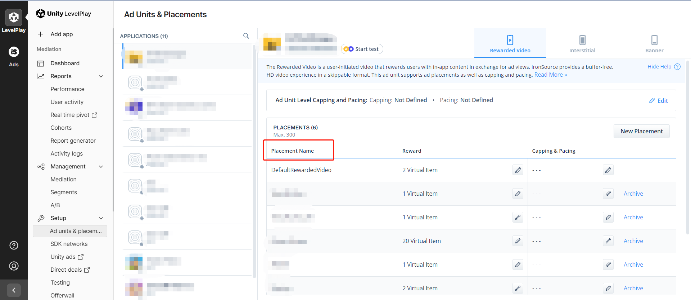
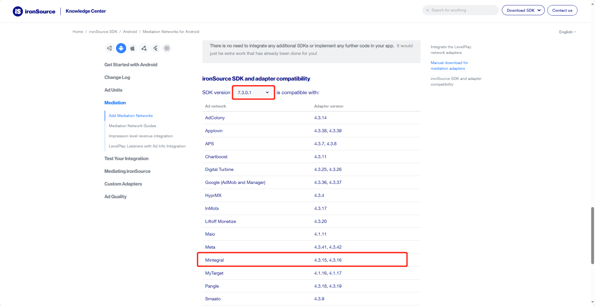

# Integration instructions

## Step 1. Integrate TopOn SDK

Please refer to [TopOn SDK Integration Documentation](https://docs.toponad.com/#/en-us/android/android_doc/android_sdk_config_access) to integrate TopOn SDK, it is recommended to integrate **TopOn v6.2.92 and above**


## Step 2. Introducing Alex Adapter

1、Add the following code in build.gradle to import the platform SDK (The following is the import code of ironSource v7.5.2)

```java
repositories {
    maven {
        //IronSource
        url "https://android-sdk.is.com/"
    }
}

dependencies {
    implementation 'androidx.appcompat:appcompat:1.2.0'
    implementation 'com.google.android.gms:play-services-appset:16.0.2'
    implementation 'com.google.android.gms:play-services-ads-identifier:18.0.1'
    
    //Add IronSource Mediation SDK dependency.
    implementation 'com.ironsource.sdk:mediationsdk:7.5.2'
}
```

2、You can choose one of the following methods:

(1) **aar**: Put alex_adapter_ironsouce.aar in the libs folder of the project module (if libs does not exist, you need to create it), and then import it in build.gradle

```java
dependencies {
    implementation fileTree(dir: 'libs', include: ['*.jar','*.aar'])
}
```

(2) **code**: 

*Copy the code in the AlexLib directory to src/main/java under the project module, and modify the package name or class name of each Adapter as needed

*Add the following obfuscation rules to the proguard-rules.pro of the project (if the class name is modified, the class name of keep needs to be changed to the modified class name)

```java
-keep class com.alex.** { *;}
-keepclassmembers public class com.alex.** {
   public *;
}
```

3、The Key used in the Adapter is described as follows:

```
"sdk_key": SDK Key of advertising platform
"plid": placement name of the advertising platform
```

The JSON configuration example when adding an ad source in the background is as follows: (xxx needs to be replaced with the actual SDK key and ad slot ID of ironSource)

```
{
    "sdk_key":"xxx",
    "plid":"xxx"
}
```


### Step 3. background configuration

1、After connecting according to the SDK docking document, you need to add a custom advertising platform in the background


2、Select [Custom Network], fill in the advertising platform name and account name, and fill in the Adapter according to the SDK docking document

*The name of the advertising platform needs to be written with ironSource, which is convenient for distinguishing the advertising platform. The suggested name format: ironSource_XXXXX


**Note**: If you use the aar method or directly use the source code method (without modifying the class name), please configure the following class name. If the class name is modified, please configure the modified class name

```
com.alex.AlexISRewardedVideoAdapter
com.alex.AlexISInterstitialAdapter
com.alex.AlexISBannerAdapter
```


3、Record Network Firm ID


4、After the advertising platform is added, add the advertising source (you can configure it according to the corresponding style when adding the advertising source)

5、You can edit the advertising platform settings, choose whether to open the report api and pull the data

6、ironSource configuration

Create Placement



Activate ironSource bidding


Configure waterfall


### Step 4. ironSource integrates with other advertising platforms

If you do not need to access other advertising platforms through ironSource, you can skip this part. Take access to Mintegral as an example:

1、Go to [TopOn Backstage](https://docs.toponad.com/#/en-us/android/download/package) first, and check which version of Mintegral is compatible with the connected TopOn version? (The Mintegral version compatible with TopOn v6.2.30 is v16.4.31)

2、Then go to [ironSource Background](https://developers.is.com/ironsource-mobile/android/mediation-networks-android/#step-2), according to the ironSource SDK version (v7.3.0.1) and Mintegral version (v16.4.31), find the corresponding Adapter version (that is v4.3.16)

**Note:**

(1) If you cannot find the Adapter corresponding to Mintegral v16.4.31, you can find the corresponding Adapter version by [viewing the Changelog of the Adapter](https://developers.is.com/ironsource-mobile/android/mintegral-change-log/)

(2) Make sure both TopOn and ironSource are compatible with Mintegral SDK



3、Introduce Gradle dependencies:

```java
dependencies {
    implementation 'com.ironsource.adapters:mintegraladapter:4.3.16'
}
```

